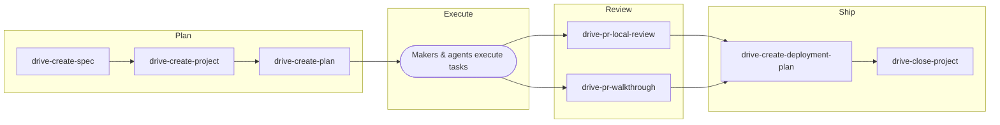

*This is Part 2 of a two-part series about how Prisma ships software with AI agents. [Agentic Engineering at Prisma](/agentic-engineering-at-prisma) covers what we found, what we changed, and how we structured a documentation layer for agents. This post goes deep on Drive, the development process, and the Maker, the role that operates within it.*

---

## What Drive is

Drive is a development process for teams where AI agents execute alongside people. It shifts the unit of managed work from tasks to projects and gives Makers full ownership while agents handle task decomposition and execution.

Scrum and similar frameworks optimize for individual task execution: story points, sprint velocity, and task boards. When agents can execute tasks reliably, the value of people shifts to project definition, architectural decisions, and outcome delivery. Drive reflects this shift.

The process is not a finished framework. It's actively evolving as the capabilities of agents change what "doing the work" looks like.

## Who are Makers

[Agentic Engineering at Prisma](/agentic-engineering-at-prisma) introduced the Maker as a product engineer who owns outcomes end-to-end. Here's where we get specific about what that means in practice.

When routine implementation is cheap, coordination and ritual become the expensive things. The Maker role pushes toward ownership and autonomy as the way to keep coordination helpful rather than letting it become a bottleneck. A Maker doesn't just write code or direct agents. They own a slice of the system and are responsible for its health, its direction, and the outcomes it delivers.

## Principles

Five principles guide how Drive operates:

1. **Projects over tasks.** The smallest unit of managed work is a project, not a task. Tasks are an implementation detail.
2. **Outcomes over output.** Progress is measured by outcomes delivered, not tasks completed.
3. **Correction over permission.** Makers act autonomously. Optimize for fast error recovery rather than upfront approval.
4. **Scope over schedule.** Drive does not use estimates or timelines. Scope discipline is what prevents projects from sprawling.
5. **Experimentation is cheap.** The cost of trying something has collapsed. Prefer trying over discussing.

## Concepts

### Lane

A lane is a Maker's area of ownership: a consistent stream of work that could include a series of projects, or a bounded slice of the system like a product, a set of services, or a scoped set of features. Each Maker owns one or more lanes.

Ownership of a lane means the Maker owns its health, reliability, and direction. The Maker defines the projects that advance the lane and is the subject-matter expert, but not the sole operator. On-call effectiveness in unfamiliar lanes is a direct measure of documentation quality.

### Initiative

An initiative groups projects that are interdependent or contribute to a larger goal across lanes or time. Use an initiative when the scope of work spans multiple projects that need coordination, potentially across multiple Makers. Not all work requires an initiative.

### Project

A project is the core unit of work in Drive. It is a scoped effort that delivers concrete outcomes, led by a single Maker. A good project has clear outcomes with defined acceptance criteria, explicit non-goals that bound scope, identified collaborators, and a focus on shipping value early.

Projects can typically be completed in about a week. This is a guide, not a rule. It keeps projects focused on delivering value rather than imposing deadlines. If scope grows during execution, the Maker pauses and re-scopes rather than extending indefinitely. If the work is consistently larger, it probably needs to be an initiative with multiple projects.

### Milestone

A milestone is a significant deliverable within a project that may not be ready to ship but can be used or validated in some way. Milestones give projects natural check-in points and make progress visible.

For example: if the project is a PDF export service, the first milestone might be the backend service callable through an endpoint. The second might be the UI integration behind a feature flag. Each milestone is usable on its own even if the full project isn't complete.

### Task

Tasks exist within projects but are not managed at the process level. They are an implementation detail:

- Agents decompose milestones or projects into tasks and execute them
- Makers work on tasks directly when judgment or creativity is required
- Work-in-progress at the task level is a diagnostic tool for project throughput, not a managed metric

### Outcome

An outcome is the measurable result a project delivers. Outcomes collectively represent the progress and health of a Maker's lanes. Business impact is owned and tracked by Product. Makers own delivering the outcomes and the technical and operational health of their lanes.

## The project lifecycle

Every project goes through five stages: Plan, Execute, Review, Ship, Delivery Review. What Scrum separates into sprint planning and sprint review ceremonies, Drive embeds directly into the project lifecycle.

### 1. Plan

Planning produces two artifacts: a **spec** and a **project plan**.

The spec is the project's source of truth, reflecting alignment with Product on the user problem and target outcomes. It covers:

- What is being built and why
- Functional and non-functional requirements derived from the problem space
- Non-goals that explicitly bound scope
- Security, observability, cost, and data protection considerations
- Open questions that need resolution before or during execution

The spec is a living document. Software systems are emergent: execution reveals information that changes the understanding of the problem, the approach, or both. The spec gets more accurate over time, not less. When the Maker learns something that materially changes the spec, they update it and re-plan. This is discovery, not scope creep.

The Maker works with the agent to turn the spec into an executable plan: acceptance criteria as binary, testable conditions, assigning collaborators, and then creating milestones and tasks. Tasks are specific enough for an agent to execute without additional context beyond the spec and the plan.

### 2. Execute

- The Maker drives the project, using agents for task execution
- Agents decompose milestones into tasks and execute them
- The Maker makes architectural and design decisions
- When execution reveals that the spec is wrong or incomplete, the Maker updates the spec and re-plans. This feedback loop is expected, not exceptional
- Progress is measured by proximity to the outcome, not tasks completed

### 3. Review

Agent-assisted review helps with standards enforcement: style, patterns, security, and compliance. Architectural decisions and complex trade-offs are reviewed by a peer. For work that affects users, Product reviews and signs off on product and user experience.

### 4. Ship

The Maker ships the project and validates the outcome against acceptance criteria. Documentation is updated. This is non-negotiable to avoid bus factors and knowledge silos. Makers can ship behind a feature flag. Product is involved in the decision to put the experience in front of users.

### 5. Delivery review

After shipping, the Maker reviews the project's delivery:

- **Outcomes**: Were acceptance criteria met? Did the project deliver its intended value?
- **Scoping accuracy**: Was the project well-scoped, or did it grow significantly? What drove the change?
- **Learnings**: What worked, what didn't, and what should change for the next project?
- **Follow-ups**: Identify any work that should become its own project, such as scope that was cut, improvements discovered during execution, or tech debt incurred

## Skills: process as code

Drive isn't just a documented process. It's an executable one. Skills are agent instruction sets that implement lifecycle stages. Each skill encodes the decisions, templates, and workflows that make the process consistent across projects and Makers.

### Planning skills

**drive-create-spec** produces a complete engineering spec by combining an engineer's input with senior-level assumptions, then iteratively refining through targeted questions. The agent fills every section of the spec template, applying principal-level engineering judgment: inferring requirements from the problem space, proposing defaults for security, observability, cost, and data protection, and deriving acceptance criteria as verification scenarios rather than restated requirements. Before drafting, the agent checks the documentation monorepo for existing standards and conventions relevant to the feature area and incorporates them.

A key constraint: requirements describe *what*, not *how*. "Connection pooling must support at least 10,000 concurrent connections with p99 latency under 5ms" is a requirement. "Use PgBouncer in transaction mode with a pool size of 200 per instance" is implementation detail for the plan. This separation keeps specs stable while giving agents and engineers flexibility in execution.

**drive-generate-plan** transforms a spec into an execution plan: milestones, tasks, and test coverage for every acceptance criterion. Each milestone produces something demonstrable, such as an endpoint, a UI, or a migration, and is ordered so that it's safe to deploy to production immediately. Tasks are sized as one shippable unit of work, typically one PR, specific enough for an agent to pick up and execute.

Test coverage is non-negotiable. Every acceptance criterion from the spec is mapped to at least one test in the plan. If a criterion can't be tested automatically, it's flagged for manual verification. This upfront test design is how we maintain quality at speed: tests aren't an afterthought, they're part of the plan before a single line of implementation is written.

The plan also syncs to our task management tool for project tracking. When it does, it creates deliverable-level issues rather than implementation-step tickets. The task manager tracks deliverables. The plan document holds the detail.

### Review skills

**drive-pr-local-review** performs first-pass code review against codified standards. It evaluates changes for best practices, clarity, performance, security, edge cases, and documentation. Findings are organized by severity: critical issues that block merging, recommendations for significant improvement, and minor suggestions. This is agent-first review, not agent-only review.

**drive-pr-walkthrough** writes a semantic narrative of a PR: the overall purpose, the sequence of conceptual steps, concrete behavior changes, and links to both implementation touchpoints and tests as evidence. It reads like intent and behavior, not a file list. Each behavior change is expressed as a "before, after" statement linked to the code and tests that back it up. This gives reviewers a fast path to understanding what changed and why, grounded in the code itself.

### Shipping skills

**drive-create-deployment-plan** generates a sequenced deployment plan with impact analysis. It consumes the spec and plan from earlier stages to produce a plan that communicates changes and their impact on users, dependent teams, and third parties, along with rollback steps and success criteria.

## No estimates, no sprints

Drive does not use story points, time estimates, velocity, or burnup charts. This is a deliberate trade-off.

Traditional estimation tries to answer "when will this be done?" by measuring how fast a team completes units of work. That requires stable, well-understood units, which assumes tasks are the managed work item and that their complexity is predictable. In Drive, tasks are an implementation detail, and agents have changed the cost profile of execution in ways that make historical velocity unreliable as a predictor.

Instead of trying to reconcile estimation with a model where execution costs keep shifting, Drive relies on:

- **Project throughput**: the number of projects completing over time is a more meaningful signal of team capacity than velocity derived from task estimates.
- **Scope discipline**: well-scoped projects with explicit non-goals and acceptance criteria keep work bounded. Estimation doesn't prevent scope creep. Scope discipline does.
- **Time-to-ship as a diagnostic**: when projects consistently take longer than the roughly one-week guideline, the signal is a scoping problem, not a scheduling one.

Work is continuous. There are no sprint boundaries, no sprint planning ceremonies, and no sprint reviews. Projects start when planned and complete when their outcome is met. The planning and review that sprints provide are embedded in the project lifecycle itself.

This means we can't give precise delivery dates for individual projects. We accept that trade-off because the cost of maintaining an estimation practice that doesn't reliably predict outcomes in this model exceeds the benefit. This position may change as the team and process mature. If estimation becomes valuable again, we'll adopt it.

## Where Makers spend their time

Now that the process is on the table, let's get specific about the Maker role in practice.

Makers operate at the system design and architecture level. With agents handling task execution and implementation, the Maker's primary value is in the decisions that shape systems: how services communicate, how data flows, how failures are handled, and how the system evolves over time. Implementation follows from those decisions, not the other way around.

A Maker must be capable of filling any role required to complete a project from start to finish:

- **System design and architecture**: how services, data, and infrastructure fit together. This is where a Maker spends most of their thinking.
- **Design**: translating product requirements into technical design
- **Implementation**: directing agents effectively
- **Testing**: validating solutions against acceptance criteria
- **Observability**: instrumenting for production visibility
- **Documentation**: capturing decisions, context, and operational knowledge
- **Scoping**: breaking large problems into well-defined projects

### Ownership

Each Maker owns one or more lanes. Product, domain, and system ownership is the team's, but Drive changes how work is allocated: one engineer and many agents per project. This avoids the coordination overhead of multiple people working on the same project while keeping team-level ownership of the system intact.

Makers own their projects from spec through delivery:

- Own the spec: draft it with your agent and you own the result
- Make architectural and design decisions
- Execute with agent assistance
- Ship and validate
- Document for others

Documentation quality matters. A Maker's documentation is measured by whether another Maker and an agent can operate in their lanes without them. On-call effectiveness and "lane trading," the ability for one engineer to take on the lane of another, is the litmus test.

### Working with agents

Agents are the Maker's primary tool for task execution. The Maker's role is to:

- Define projects clearly enough that agents can decompose them into tasks
- Make judgment calls that agents cannot: trade-offs, product decisions, and ambiguous requirements
- Review and validate agent output
- Correct course quickly when output misses the mark

A Maker is not measured on how many tasks they complete. They are measured on the outcomes they deliver.

### Supporting roles

Product, engineering management, and similar functions are evolving into supporting roles aimed at guiding and removing friction for Makers. "Removing friction" means reducing execution overhead and approval layers, not reducing Product's ownership of what we build and whether it's the right product and user experience.

Product is involved in specifying which user problems and outcomes should be worked on, and in reviewing and signing off on product and user experience. Supporting roles provide:

- **Customer insight**: what are users experiencing? What do they need?
- **Priority guidance**: which problems matter most right now?
- **Decision support**: context, data, and perspective that help Makers make better decisions

Makers hold decision-making power over how work gets done. Supporting roles ensure Makers have the information and context to make those decisions well.

## This is not finished

Drive is not a finished framework. Engineers feed changes directly into the process through skills and process adjustments. That's by design. The process itself is maintained the same way we maintain code: propose a change, review it, ship it.

If something about Drive isn't working, the fix is a PR away.
