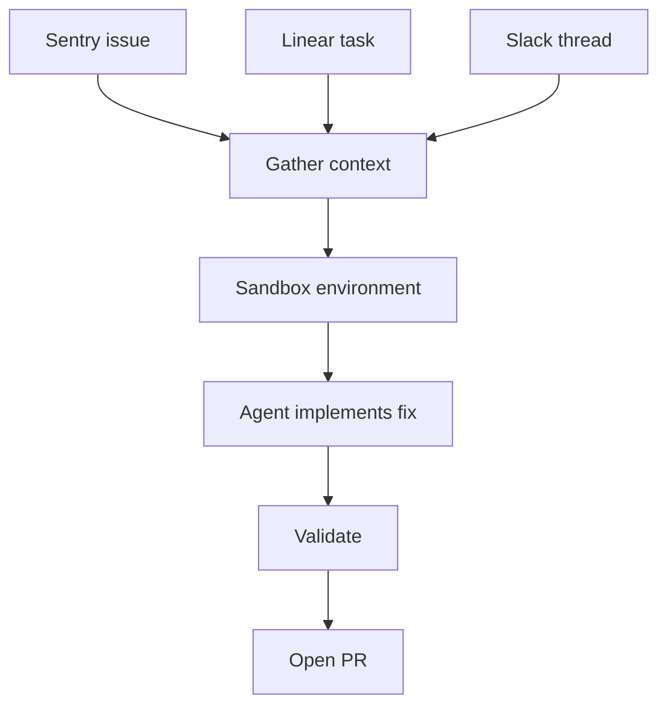

Every engineering organisation has a long tail of small problems.

A noisy Sentry issue. A flaky edge case. A minor performance regression. A bug that is understood, annoying, and never quite important enough to interrupt the current roadmap.

Individually, these issues are small. Collectively, they create drag. They interrupt engineers, pollute error dashboards, and accumulate into operational debt. The cost is not just fixing them. It is the context switch: reproduce the failure, find the right code, make a change, validate it, and shepherd the fix through review.

**Gremlin** is my attempt to reduce that friction. It is an autonomous engineering agent scoped to small and medium-sized tasks: identify a well-scoped issue, gather context, make a targeted code change, and open a reviewable pull request.

The goal is to remove the low-leverage interruptions that keep engineers from larger, higher judgement work.

## Why start with small tasks?

"Build an AI engineer" is not a useful product requirement. It is too vague, too unconstrained. [Devin](https://devin.ai/) is pushing in that direction at scale, and the results are impressive. I am not setting out to rebuild an entire product like that. Starting small and focused helps me build something relevant to my team and to Prisma's users.

Real engineering work is messy: codebases have conventions, permissions, runtime assumptions, deployment constraints, and review expectations.

Gremlin starts with a more practical question: what work is valuable, repetitive enough to justify automation, and bounded enough that an agent can safely attempt it?

[Sentry](https://sentry.io/) issues are a good first target. They carry a concrete failure signal: stack traces, affected files, runtime context, frequency, environment, and sometimes user impact. Many are not architectural problems. They are localised defects or rough edges that require judgement but not deep product strategy.

[Sentry Seer](https://sentry.io/lp/seer/) already exists: an AI layer that investigates production errors and opens pull requests. That capability is real, but it lives inside a single surface, the Sentry user interface. Gremlin takes a different angle: orchestration across the systems where engineering work actually happens, not just where the error was reported.

Gremlin can inspect the issue, connect it to the relevant code, generate a fix, run checks where available, and raise a pull request for review. Even when the PR is not perfect, it can shrink the initial investigation from forty-five minutes to five.

The first version of Gremlin is not a general-purpose autonomous developer. It is a focused system for converting well-scoped engineering signals into concrete, reviewable patches.

## The core workflow

Tasks enter Gremlin from more than one place. A Sentry issue can trigger a run when it matches scope criteria. Anyone can also assign work manually through Linear or Slack when they have something well-bounded.

At a high level, Gremlin follows a simple loop:

The interesting part is not any single step. It is the orchestration between them.

A coding agent by itself is not enough. It needs the right repository state, credentials, issue context, permissions, runtime constraints, and guardrails. Without that, the agent either cannot act or acts in ways that are too brittle to trust.

That is where **[Mastra](https://mastra.ai/docs)** comes in.

## Mastra as the orchestration layer

Gremlin uses [Mastra](https://mastra.ai/docs) as the orchestration layer around the coding agent. The agent does not receive a vague instruction and operate freely. Mastra prepares the task, controls the environment, injects credentials and context, and defines the boundaries in which the agent can operate.

The architecture separates responsibilities:

- **Mastra** handles orchestration, task setup, credential injection, access validation, and workflow control.
- **[OpenCode](https://opencode.ai/)** runs as the sandboxed coding agent inside that environment. It is the open-source agent that performs the implementation work: navigating the repo, editing files, and running checks. See the [OpenCode docs](https://opencode.ai/docs) for how it is configured and extended.
- The **model provider** is exchangeable. OpenCode supports many LLM providers; Gremlin can swap models without changing the orchestration layer or the workflow around the PR.

This lets Gremlin use an autonomous coding loop while preserving a clear operational boundary. The system can attempt fixes without granting unconstrained access to production systems or sensitive infrastructure.

## Why sandboxing alone was not enough

An early instinct was to treat Gremlin primarily as a sandboxing problem. Give the agent a repo, give it the issue, let it work.

In practice, that framing was incomplete. Sandboxing controls *where* the agent runs. It does not solve the workflow problem. The agent still needs to know what task it is solving, what code it can access, which secrets it may use, which checks matter, how to authenticate to internal systems, and how to report its work.

Isolation is necessary, but not sufficient. The harder problem is orchestration: converting operational signals into well-formed engineering tasks, setting up the environment correctly, enforcing access boundaries, and routing the result back into normal engineering workflows.

That is why Mastra became central to the architecture.

## What Gremlin does today

Gremlin is scoped around small to medium-sized engineering tasks with clear, bounded scope.

**Automated Sentry fixes** are the clearest automated entry point. When an issue matches scope criteria, Gremlin collects context, reasons about the failure, makes a targeted code change, and opens a PR.

**Instructions through Linear or Slack** covers the rest of the tasks. The instruction could cover things like add a field to an API response, fix a button alignment issue, correct copy on a settings page. The scope is narrow; the acceptance criteria are implicit or stated in the message.

That second path matters for the work people spot in passing:

- A bug an engineer or agent notices during implementation, logged without pulling either off the task they are already on
- A styling or copy issue anyone flags in Slack
- A regression with a clear repro that is not worth a context switch right now
- Cleanup with an obvious before and after

These are not architectural problems. They are real, localised changes where the cost of picking them up manually is the problem, not the difficulty of the fix itself.

Gremlin should not begin by making broad architectural decisions, rewriting major subsystems, or interpreting ambiguous product requirements. Those tasks require deeper context, stakeholder alignment, and trade-off analysis. They may become partially automatable later, but they are not the right starting point.

The correct initial target is well-scoped work: real, valuable, and bounded enough that an engineer can tell when it is done.

## The pull request as the interface

One of the most important product decisions is that Gremlin's output is a pull request.

Engineers and agents already know how to review PRs. CI systems already know how to validate them. Code owners, branch protections, comments, and review workflows already exist. A separate process for agent-generated work would add friction, not remove it.

A Gremlin PR should explain:

- What issue triggered the change
- What the agent changed
- Why the change is expected to fix the issue
- What validation was performed
- What uncertainty remains

That last point matters. Trustworthy automation surfaces uncertainty clearly. A good Gremlin PR is not just a patch. It is a review artifact that helps an engineer and agent decide whether the change is safe.

## Current boundaries

Gremlin is not intended to handle every engineering task today. It works best when the task is well-scoped, the relevant context is available, and the expected change is localised. It is less appropriate for work that requires open-ended product judgement, large-scale refactoring, unclear ownership, or deep cross-system design.

This is not a weakness of the approach. It is part of making the system useful. By defining the boundary clearly, Gremlin can be evaluated honestly, improved against real tasks rather than hypothetical ones, and earn trust in a limited domain before expanding.

Engineering teams will not adopt an autonomous agent because it is impressive in a demo. They will adopt it if it repeatedly saves them time without creating hidden risk.

## What I learned building it

One lesson is that the agent is only one part of the product. The surrounding system matters just as much.

A capable coding model still needs task framing, context retrieval, environment setup, permissions, validation, and output formatting. Without those, even a strong agent produces inconsistent results. With them, the same agent becomes much more useful.

The other lesson is about the economics of small work, not the difficulty of small fixes. When the context is clear, a bounded bug usually does not need much judgement. The problem is that picking it up still has a cost, and that cost is rarely worth paying in the moment.

Two failure modes show up repeatedly.

**Small issues accumulate because fixing them one at a time never pays off.** A typo in an error message, a missing null check, a button that misaligns on mobile. Each is the kind of paper cut that takes ten minutes if you stop what you are doing, reproduce it, branch, validate, and open a PR. So they wait. They pile up. The dashboard gets noisier. The product gets rougher at the edges. Gremlin changes the math by moving that work off the engineer's machine and into a sandbox where it can run without interrupting anything else.

**Side quests delay the work that actually matters.** An engineer spots something small while implementing a feature and decides to fix it now because it is right there. That fix fails tests, introduces a regression, or expands scope in a way that has nothing to do with the feature they were shipping. I have seen features stall or fail to merge because of a handful of unrelated fixes bundled into the same PR. Gremlin is a way to offload those tangents: log the issue, assign it, let it run elsewhere, review the PR when it is ready.

The product challenge is not getting an agent to write code. It is getting an agent to absorb work that is cheap to describe but expensive to pick up in the middle of something else.

## From tasks to projects

The longer-term vision for Gremlin goes beyond the long tail. Once the system can reliably handle bounded tasks, the next step is picking up work that is already well defined elsewhere and executing it in a sandbox.

At Prisma, that definition already exists. As I wrote in [Agentic Engineering at Prisma](/agentic-engineering-at-prisma), projects run through [Drive and the Maker](/drive-and-the-maker): upfront specs, milestones, acceptance criteria, and test coverage mapped before implementation starts. [Agent skills](https://platform.claude.com/docs/en/agents-and-tools/agent-skills/overview) already encode much of that process. Gremlin does not need to invent the planning layer. The future goal is to take tasks and milestones that are already specified through that process and turn them into actual changes without the engineer running another agent locally on their laptop.

That matters because engineers are already hitting local machine resource limits. Parallel agents, parallel workstreams, a feature branch in one window and a review in another: the execution load is moving faster than a single machine can comfortably carry. Gremlin moves execution off the engineer's machine and into an isolated environment where work can run in the background. The engineer stays focused on judgement, review, and the work that still needs them in the loop.

This is a different problem from fixing a Sentry issue or a Slack instruction. It requires tracking state across multiple PRs, respecting dependencies between milestones, and knowing when not to proceed. But the path starts with reliable execution on smaller tasks. Gremlin's current architecture is designed with that progression in mind. Mastra provides the orchestration layer needed to move from one-off task execution towards longer-running workflows.

## Fix with AI

The most interesting product direction for Gremlin is not a separate agent console. It is **Fix with AI**: a button in the places where Prisma already surfaces a problem, wired to orchestration that returns a pull request instead of a prompt to paste elsewhere.

That pattern only works if something like Gremlin sits behind it. Detection alone is not enough. The product has to gather context, spin up a sandbox, attempt a bounded fix, validate what it can, and route the result back into normal review workflows. Without that layer, "Fix with AI" is just another copyable prompt and the friction moves, it does not disappear.

Prisma is already moving in this direction. With the [launch of Prisma Compute in public beta](https://www.prisma.io/blog/launching-prisma-compute-public-beta), the platform is built around an agentic loop: build, deploy, read logs, fix, and redeploy, with app and database on the same infrastructure. The hard part is no longer only writing code. It is everything after: chasing build output, feeding log context back into the agent, and keeping that loop inside one place instead of jumping between dashboards.

Gremlin is how we extend that loop outward, into the repositories and review processes teams already use.

### Query Insights today

[Query Insights](https://www.prisma.io/docs/query-insights) is the clearest existing example. It is built into Prisma Postgres and surfaces slow queries, expensive reads, and repeated statement shapes. When a query group is hurting performance, the console already answers a useful question: what should change next?

Today that answer often arrives as AI-generated analysis and a copyable prompt. The engineer still switches to an editor, applies the fix, runs checks, and opens a PR. **Fix with AI** closes that gap. Query Insights detects the issue and passes structured context to Gremlin; Gremlin returns a reviewable pull request. The engineer's interface becomes the PR, not another surface to babysit.

## What comes next

Autonomous engineering systems do not need to start by replacing large parts of the software development lifecycle. A more practical path is to begin where the pain is concrete and the scope is bounded.

Gremlin starts with the long tail of well-scoped work: Sentry noise, Slack and Linear instructions, and the fixes nobody picks up because the interrupt cost is too high. By combining Mastra's orchestration layer with OpenCode, Gremlin turns that work into reviewable pull requests while preserving clear boundaries and leaving the merge decision where it belongs: with the engineer reviewing the PR.

The current focus is small to medium-sized tasks. The longer-term direction is larger project execution, **Fix with AI** wired into more Prisma surfaces, and proactive operational quality across [Compute](https://www.prisma.io/blog/launching-prisma-compute-public-beta) and Postgres. The core principle remains the same: agents are most useful when they are embedded into real workflows, constrained by clear boundaries, and evaluated by the amount of friction they remove.
